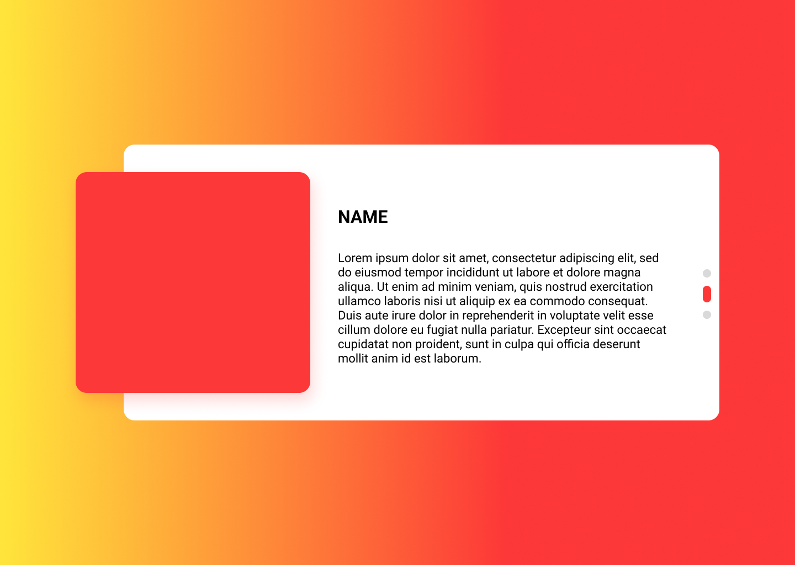

# GitHarvest

A GitHub API Consumption - JavaScript Project

## Project Overview

This project is a JavaScript-based application designed for a user management agency. The purpose is to retrieve and display users informations from GitHub's public API. The app fetches and shows details of 8 users at a time, including their profile picture, username, and a description (bio). If the description is missing, a default message `"No description available"` will be displayed.

## 🎯 Functional Specifications

### API Request

- Fetch information for **multiple users** at a time using the GitHub API.
  
### Displayed Data

- **Profile Image**: GitHub user’s avatar.
- **Username**: GitHub handle (login).
- **Description**: A bio or description. If missing, show `"No description available"`.

## 🛠️ Technologies Used

- **AJAX**: For making asynchronous HTTP requests.
- **JSON**: For handling the response data from the GitHub API.

## 📷 Mockup

<p align="center">
  
  
</p>

### GitHub API Request

To fetch 8 random users from GitHub, the following API URL is used:
https://api.github.com/users?per_page=8
The API response will return user information in **JSON format**.

### Example Response

A typical response from the API may look like:

```json
[
  {
    "login": "kevinbenard",
    "id": 1,
    "node_id": "MDQ6VXNlcjE=",
    "avatar_url": "https://avatars.githubusercontent.com/u/1?v=4",
    "gravatar_id": "",
    "url": "https://api.github.com/users/kevinbenard",
    "html_url": "https://github.com/kevinbenard",
    "followers_url": "https://api.github.com/users/kevinbenard/followers",
    "following_url": "https://api.github.com/users/kevinbenard/following{/other_user}",
    "gists_url": "https://api.github.com/users/kevinbenard/gists{/gist_id}",
    "starred_url": "https://api.github.com/users/kevinbenard/starred{/owner}{/repo}",
    "subscriptions_url": "https://api.github.com/users/kevinbenard/subscriptions",
    "organizations_url": "https://api.github.com/users/kevinbenard/orgs",
    "repos_url": "https://api.github.com/users/kevinbenard/repos",
    "events_url": "https://api.github.com/users/kevinbenard/events{/privacy}",
    "received_events_url": "https://api.github.com/users/kevinbenard/received_events",
    "type": "User",
    "site_admin": false
  },
  ...
]
```
[Here](https://jeremy-roussy.github.io/GitHarvest/) you can see the project. The app will automatically fetch and display information for 8 GitHub users.

## 📄 License
This project is licensed under no license.

